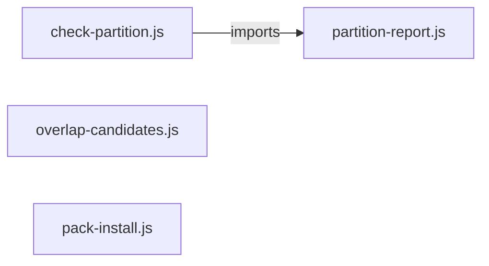

# `tools/` — 4 module(s)

4 module(s).

## Dependencies

## `js:tools/check-partition.js`

- fan-in: 1, fan-out: 3

### Symbols
  - `escapeRe` (function) → js:tools/check-partition.js:29 — `escapeRe = (s) => s.replace(/[.*+?^${}()|[\]\\]/g, '\\$&')`
  - `scriptPattern` (function) → js:tools/check-partition.js:48 — `function scriptPattern(name, fromKind)`
  - `libPattern` (function) → js:tools/check-partition.js:56 — `function libPattern(name, fromKind)`
  - `skillPattern` (function) → js:tools/check-partition.js:64 — `function skillPattern(name)`
  - `agentPattern` (function) → js:tools/check-partition.js:70 — `function agentPattern(name)`
  - `hardRefPattern` (function) → js:tools/check-partition.js:75 — `function hardRefPattern(kind, name, fromKind)`
  - `specName` (function) → js:tools/check-partition.js:105 — `specName = (spec) => String(spec).replace(/\.js$/, '').split('/').pop()`
  - `tryBlockSpans` (function) → js:tools/check-partition.js:108 — `function tryBlockSpans(text)`
  - `optionalRefs` (function) → js:tools/check-partition.js:124 — `function optionalRefs(text)`
  - `hardRefs` (function) → js:tools/check-partition.js:133 — `function hardRefs(text, names, optional = new Set(), fromKind = null)`
  - `guardedEdges` (function) → js:tools/check-partition.js:147 — `function guardedEdges(from, optionalNames, ids, assign)`
  - `partitionAccepted` (function) → js:tools/check-partition.js:162 — `function partitionAccepted(accepted)`
  - `recordEdge` (function) → js:tools/check-partition.js:178 — `function recordEdge(from, to, home, target, acceptedMap, sink)`
  - `checkPartition` (function) → js:tools/check-partition.js:186 — `function checkPartition({ assign, texts, names, accepted = [] })`
  - `walk` (function) → js:tools/check-partition.js:214 — `function walk(dir, acc = [])`
  - `readUnit` (function) → js:tools/check-partition.js:225 — `readUnit = (files) => files.map((f) =>`
  - `loadAssignment` (function) → js:tools/check-partition.js:229 — `function loadAssignment(partition)`
  - `loadUnitTexts` (function) → js:tools/check-partition.js:240 — `function loadUnitTexts()`
  - `main` (function) → js:tools/check-partition.js:257 — `function main()`

## `js:tools/overlap-candidates.js`

- fan-in: 1, fan-out: 2

### Symbols
  - `round2` (function) → js:tools/overlap-candidates.js:55 — `round2 = (n) => Math.round(n * 100) / 100`
  - `fileOf` (function) → js:tools/overlap-candidates.js:56 — `fileOf = (w) => String(w || '').split('#')[0]`
  - `tokens` (function) → js:tools/overlap-candidates.js:58 — `function tokens(text)`
  - `jaccard` (function) → js:tools/overlap-candidates.js:63 — `function jaccard(a, b)`
  - `prepare` (function) → js:tools/overlap-candidates.js:71 — `function prepare(control)`
  - `pairSignals` (function) → js:tools/overlap-candidates.js:84 — `function pairSignals(a, b)`
  - `makePair` (function) → js:tools/overlap-candidates.js:93 — `function makePair(a, b, signals)`
  - `clusterOverlaps` (function) → js:tools/overlap-candidates.js:106 — `function clusterOverlaps(controls)`
  - `loadControls` (function) → js:tools/overlap-candidates.js:130 — `function loadControls(manifest)`
  - `buildMarker` (function) → js:tools/overlap-candidates.js:143 — `function buildMarker(controls, now)`
  - `auditedIds` (function) → js:tools/overlap-candidates.js:147 — `function auditedIds(marker)`
  - `staleControls` (function) → js:tools/overlap-candidates.js:154 — `function staleControls(controls, marker)`
  - `readMarker` (function) → js:tools/overlap-candidates.js:159 — `function readMarker()`
  - `printStale` (function) → js:tools/overlap-candidates.js:163 — `function printStale(stale, marker)`
  - `printResidual` (function) → js:tools/overlap-candidates.js:172 — `function printResidual(residual)`
  - `printReport` (function) → js:tools/overlap-candidates.js:179 — `function printReport({ pairs, residual, units })`
  - `runCluster` (function) → js:tools/overlap-candidates.js:190 — `function runCluster(controls, asJson)`
  - `runRecord` (function) → js:tools/overlap-candidates.js:197 — `function runRecord(controls)`
  - `runStale` (function) → js:tools/overlap-candidates.js:205 — `function runStale(controls)`
  - `main` (function) → js:tools/overlap-candidates.js:211 — `function main()`

## `js:tools/pack-install.js`

- fan-in: 2, fan-out: 2

### Symbols
  - `loadPartition` (function) → js:tools/pack-install.js:60 — `function loadPartition(file = PARTITION)`
  - `mergeSpec` (function) → js:tools/pack-install.js:64 — `function mergeSpec(into, spec)`
  - `resolveSelection` (function) → js:tools/pack-install.js:75 — `function resolveSelection(partition, packs = [])`
  - `filesFor` (function) → js:tools/pack-install.js:89 — `function filesFor(selection)`
  - `copyRecursive` (function) → js:tools/pack-install.js:100 — `function copyRecursive(from, to)`
  - `materialize` (function) → js:tools/pack-install.js:111 — `function materialize(outDir, rels)`
  - `declaredNames` (function) → js:tools/pack-install.js:124 — `function declaredNames(partition)`
  - `undeclaredUnits` (function) → js:tools/pack-install.js:141 — `function undeclaredUnits(partition, root = ROOT)`
  - `argValue` (function) → js:tools/pack-install.js:156 — `function argValue(argv, flag)`
  - `listPacks` (function) → js:tools/pack-install.js:161 — `function listPacks(partition)`
  - `main` (function) → js:tools/pack-install.js:170 — `function main(argv = process.argv.slice(2))`

## `js:tools/partition-report.js`

- fan-in: 2, fan-out: 0

### Symbols
  - `installs` (function) → js:tools/partition-report.js:13 — `function installs(profile, pack)`
  - `computeProfileBreaks` (function) → js:tools/partition-report.js:20 — `function computeProfileBreaks(crossPack, profiles)`
  - `reportCrossPack` (function) → js:tools/partition-report.js:32 — `function reportCrossPack(crossPack)`
  - `reportProfileBreaks` (function) → js:tools/partition-report.js:46 — `function reportProfileBreaks(breaks)`
  - `reportViolations` (function) → js:tools/partition-report.js:55 — `function reportViolations(violations)`
  - `printReport` (function) → js:tools/partition-report.js:72 — `function printReport({ partition, assign, result })`
